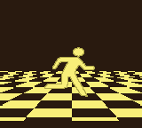

# Horror Demo
A little testbed for some pseudo 3D perspective effects with LYC raster line copying tricks. Hopefully will spin this into a full demoscene demo. 

## Build instructions
This was written originally for `rgbasm v0.5.2`. Other versions don't function properly with the current state of the project.