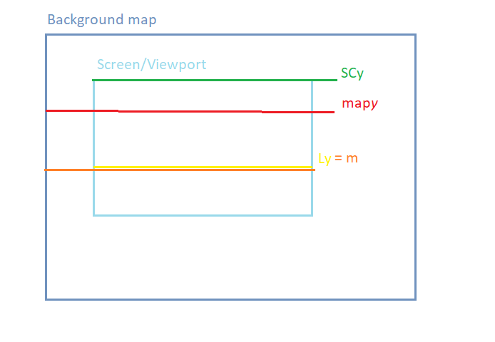

### carpet calculation

$SC_y: \text{Position of viewfinder / scroll register (rSCY)}$\
$map_y: \text{Requested line in background map (position from LUT in virtual screen)}$\
$L_y: \text{Line being currently drawn (rLy)}$\
$m:L_y \text{ in the background map's plane}$\

\
$m - map_y = 0$   ,   $(SC_y + Ly) - mapy = 0$\
$(SC_y + L_y) - map_y = 0$\
$SC_y + L_y = map_y$\
$\therefore SC_y = map_y - L_y$
